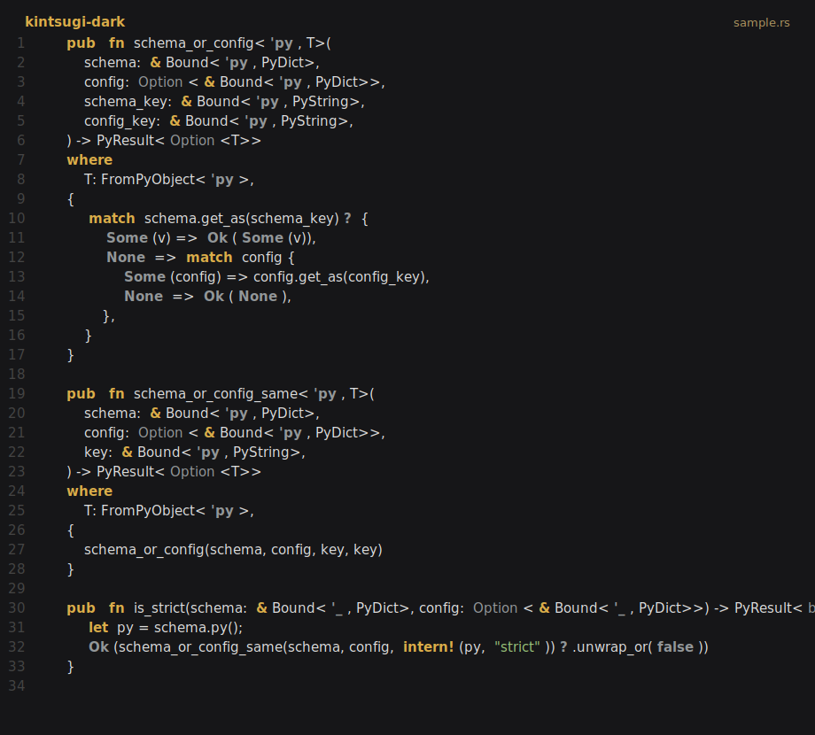
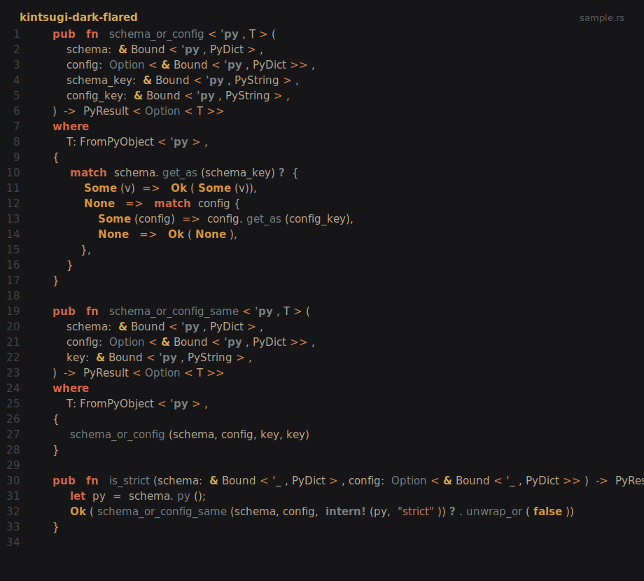
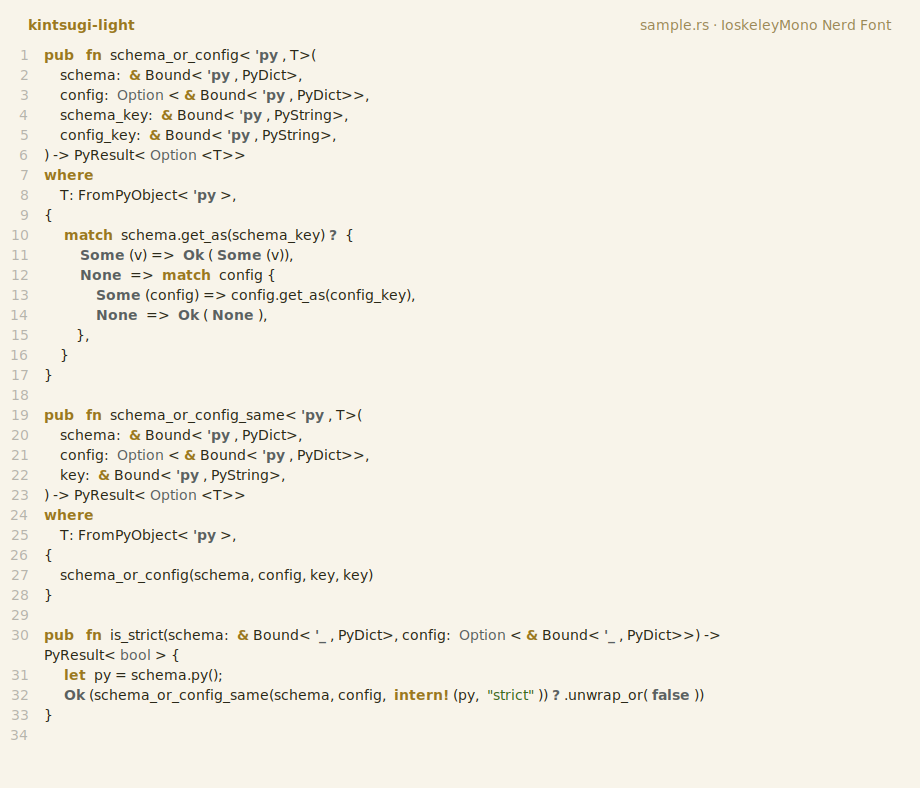
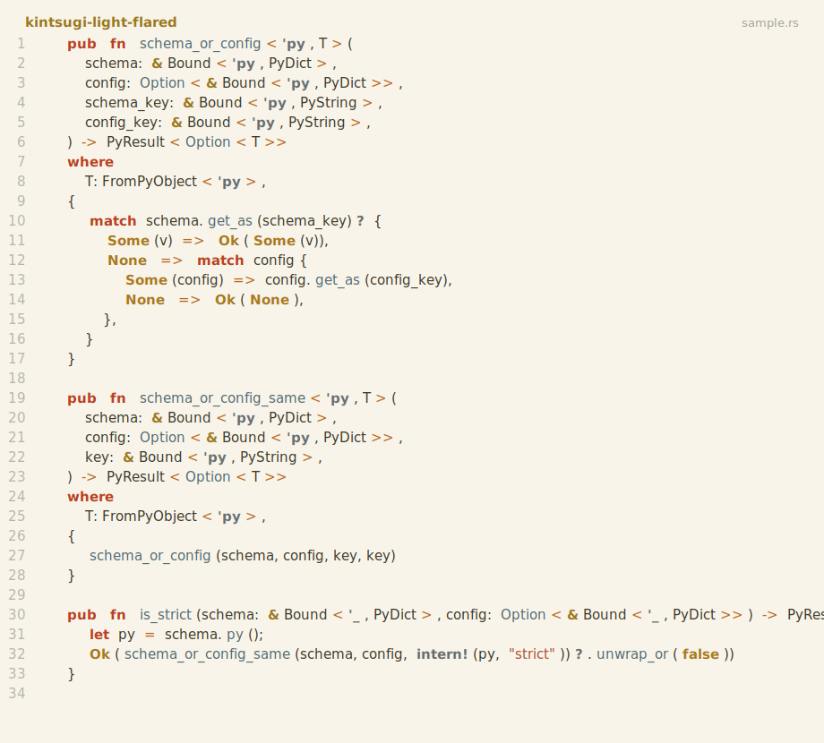

# Kintsugi for Neovim

A Neovim colorscheme port of the beautiful [VS Code Kintsugi] theme by Ahmed Hatem.

This project keeps the slim, direct-highlight architecture of [papercolor-theme-slim]: no Lua module, no runtime color builder, and no abstraction inside the colorscheme files. The theme is written in Vimscript because `colors/*.vim` is Neovim's native colorscheme format and direct `:highlight` definitions are simple, fast, and easy to override.

## Variants

`kintsugi-dark` is the primary/default variant.

- `kintsugi-dark`
- `kintsugi-dark-flared`
- `kintsugi-light`
- `kintsugi-light-flared`

Preview SVGs are generated from [gallery/inputs/sample.rs](gallery/inputs/sample.rs) with `make gen-variants`.

| `kintsugi-dark` | `kintsugi-dark-flared` |
| --- | --- |
|  |  |

| `kintsugi-light` | `kintsugi-light-flared` |
| --- | --- |
|  |  |

## Installation

Install this repository like any other [Neovim package] or colorscheme plugin.

## Configuration

```vim
set termguicolors

" Primary/default variant
colorscheme kintsugi-dark

" Other variants
" colorscheme kintsugi-dark-flared
" colorscheme kintsugi-light
" colorscheme kintsugi-light-flared

" Ensure cursor highlights predictably.
set guicursor=n-v-sm:block-Cursor,i-ci-c-ve:ver25-Cursor,r-cr-o:hor20-Cursor

" Recommended if using Neovim 0.11+.
set winborder=rounded
```

## Customization

Use normal Neovim highlight overrides. Define overrides before loading the colorscheme when possible.

### Transparent background

```vim
autocmd ColorScheme kintsugi-dark,kintsugi-dark-flared,kintsugi-light,kintsugi-light-flared highlight Normal guibg=NONE
```

### Override a color

```vim
autocmd ColorScheme kintsugi-light highlight Normal guibg=#f8f4ea
```

### Third-party plugin support

```vim
function s:kintsugi_linking()
  highlight link ExamplePluginHighlightGroup CursorLine
endfunction

augroup colorscheme_overrides_custom
  autocmd!
  autocmd ColorScheme kintsugi-dark,kintsugi-dark-flared,kintsugi-light,kintsugi-light-flared call s:kintsugi_linking()
augroup end
```

## Credits

- Colors ported from [VS Code Kintsugi] by Ahmed Hatem.
- Vimscript colorscheme architecture based on [papercolor-theme-slim] by Samuel Roeca.

[Neovim package]: https://neovim.io/doc/user/usr_05.html#_adding-a-package
[VS Code Kintsugi]: https://github.com/ahatem/vscode-kintsugi
[papercolor-theme-slim]: https://github.com/pappasam/papercolor-theme-slim
[winborder]: https://neovim.io/doc/user/options.html#'winborder'

## License

MIT License - see [LICENSE](LICENSE) for details.
